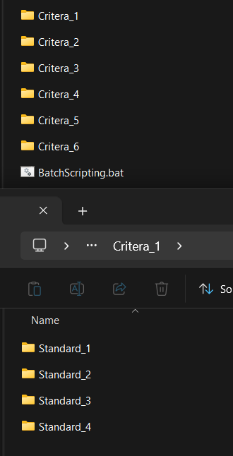
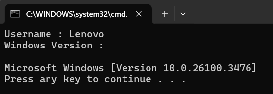
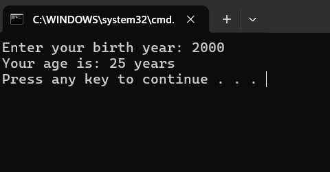
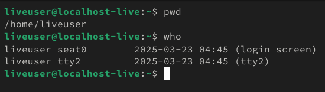
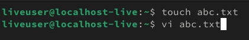
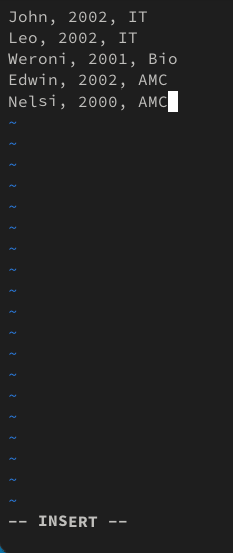
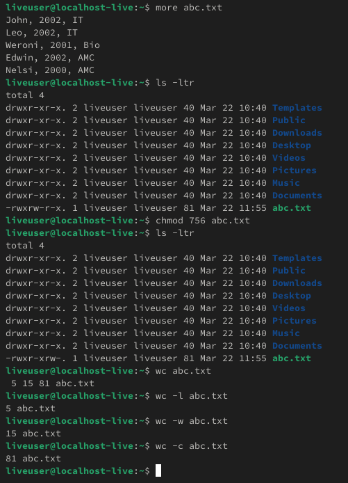
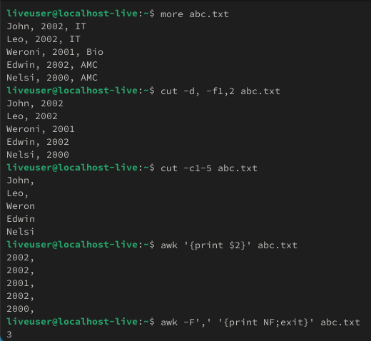
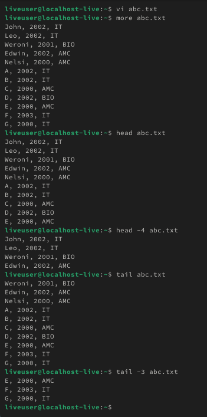
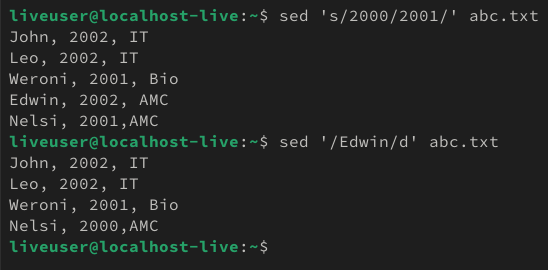

# CMD Commands
  
  | Codes | Output |
  |-------|--------|
  |['BatchScripting.bat'](./CMD_Commands/Codes/BatchScripting.bat)||
  |['Print.bat'](./CMD_Commands/Codes/Print.bat)||
  ['AgeCalculator.bat'](./CMD_Commands/Codes/AgeCalculator.bat)||
  ['DateCalculator.bat'](./CMD_Commands/Codes/DateCalculator.bat)||

  # Linux Commands

  | Codes | Output |
  |-------|--------|
  |['Linux_Commands.txt'](./LINUX_Commands/Codes/Linux_Commands.txt)||
  | ||
  | ||
  | ||
  | ||
  | ||
  | ||
  | ||
