  | Codes | Output |
  |-------|--------|
  |['Print_hello_world.txt'](./Codes/Print_hello_world.txt)|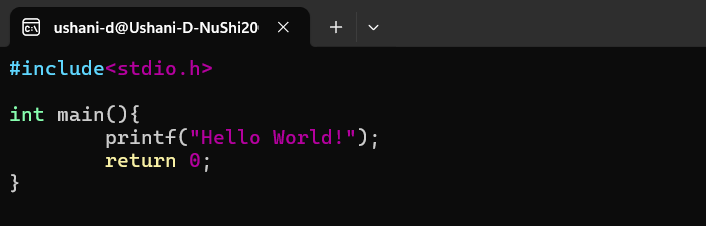|
  | |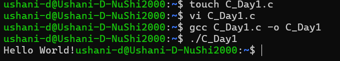|
  |['Variables.txt'](./Codes/Variables.txt)|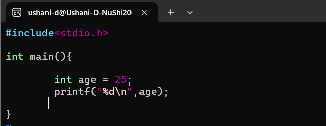|
  | | |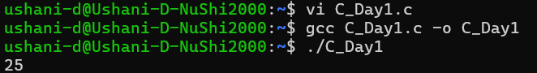|
  | |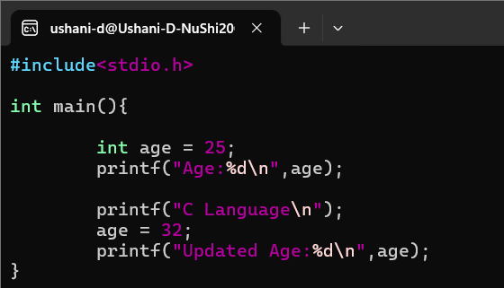|
  | |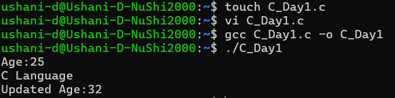|
  | |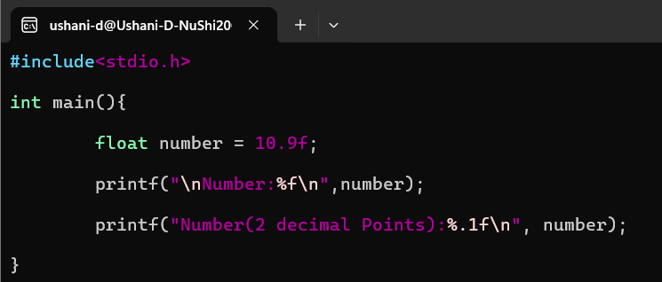|
  | |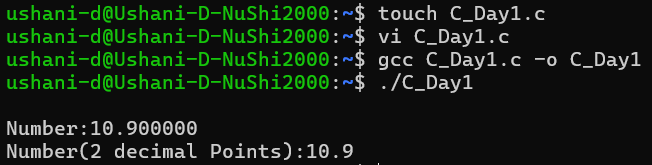|
  | |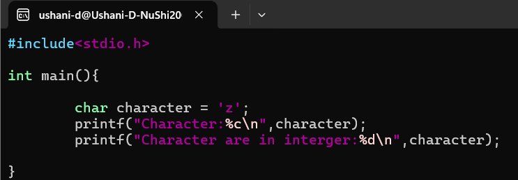|
  | |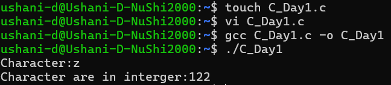|
  |['UserInput.txt'](./Codes/UserInput.txt)|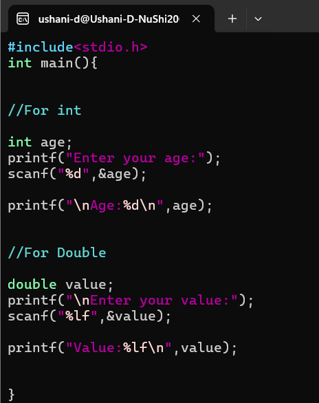|
  | |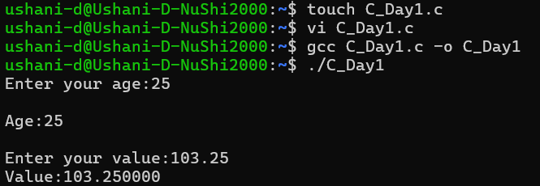|
  | |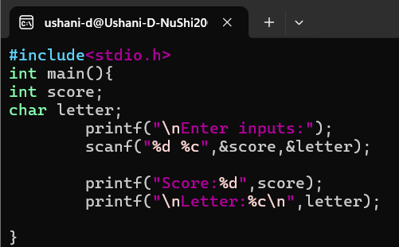|
  | |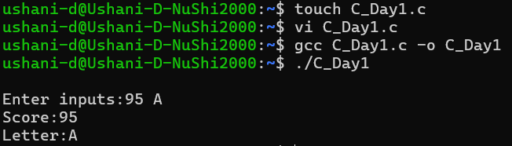|
  |['Calculator.txt'](./Codes/Calculator.txt)|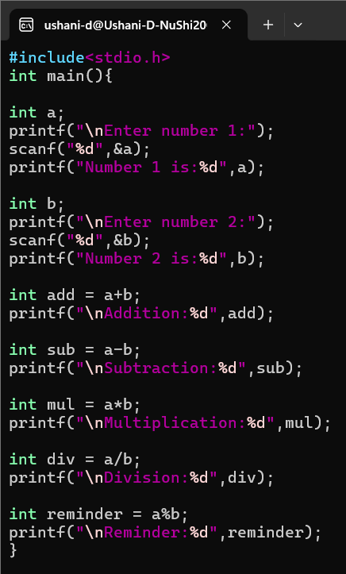|
  | |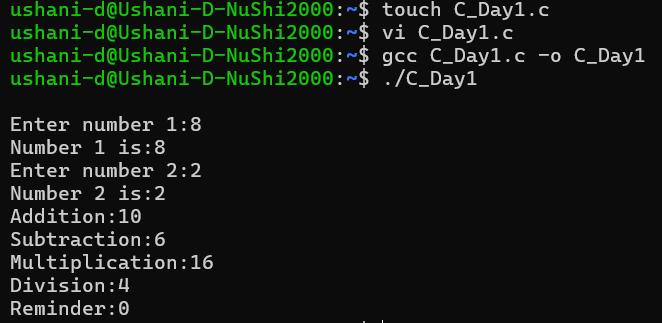|
