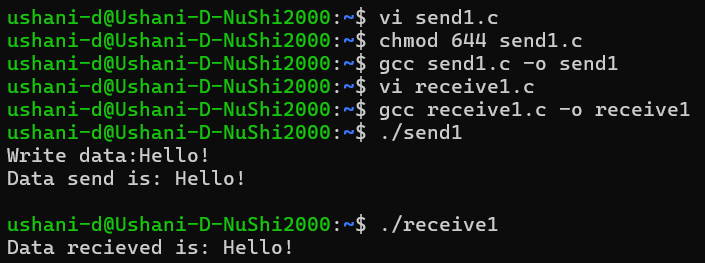

  | Codes | Output |
  |-------|--------|
  | ## Method 01| |
  |['send.c'](./Codes/send.c) / ['receive.c'](./Codes/receive.c)| |
  | ## Method 02| |
  |['send1.c'](./Codes/send1.c) / ['receive1.c'](./Codes/receive1.c)| |
