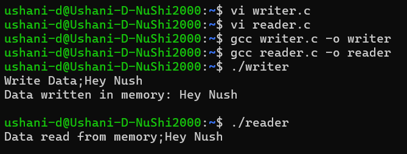
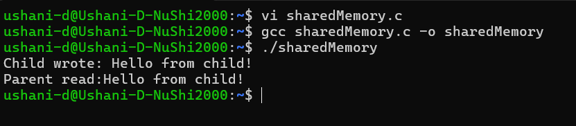
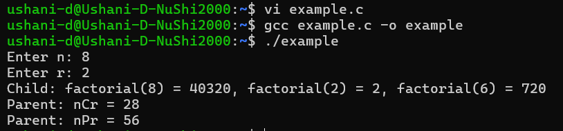

  | Codes | Output |
  |-------|--------|
  |['reader.c'](./Codes/reader.c)/['writer.c'](./Codes/writer.c)||
  |['sharedMemory.c'](./Codes/sharedMemory.c)||
  |['Exercise.c'](./Codes/Exercise.c)||
