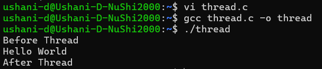
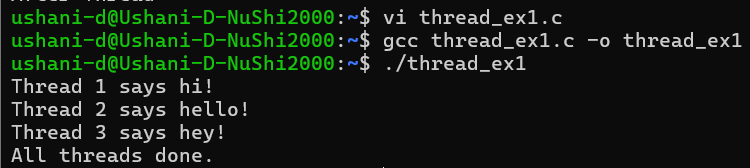
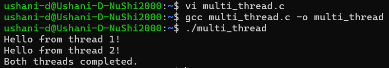
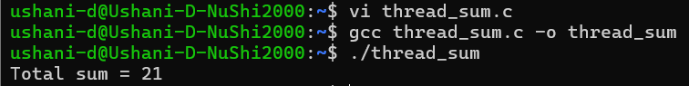

  | Codes | Output |
  |-------|--------|
  |['thread.c'](./Codes/thread.c)||
  |['thread_ex1.c'](./Codes/thread_ex1.c)||
  |['multi_thread.c'](./Codes/multi_thread.c)||
  |['thread_sum.c'](./Codes/thread_sum.c)||
